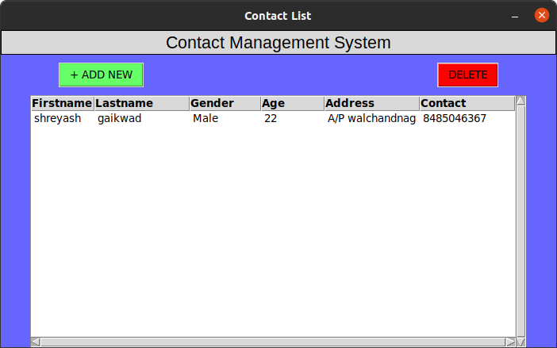
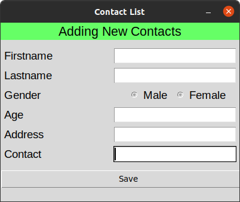

<h1 align="cemter">Contact-management-system(Python Mini project)</h1>

It is simple python project implemented by python libraries like Tkinter,sqlite etc 
 

<h1 align="cemter">Contact-management-system Home page</h1>
  
<h1 align="cemter">when you click on add button</h1> 
  

